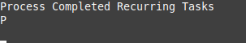

# **Packrat** 🐀



This plugin for [Obsidian.md](https://obsidian.md/) adds functionality to Martin Schenck's indispensable  [Obsidian Tasks](https://github.com/schemar/obsidian-tasks) plugin.

| :exclamation:  Don't install **Packrat** unless you use **Tasks**! |
|--------------------------------------------------------------------|

**Tasks** supports tasks with recurrence rules:  when **Tasks** is used to mark a recurring task as having been completed, it inserts the next instance of that task in a new line above the just-completed instance.

## And what's wrong with that?

The above behavior is "alright"; but *completed instances of recurring tasks* tend to accumulate in the note file in which they originate.  Items that recur every few days, or even every week, quickly begin to clutter up the note they're in.

## What are you gonna do about it?

After some reflection, I realized that my completed recurring tasks fall into three categories:

1. those that I don't care to keep -- they can be deleted
2. those that I want to retain within their original note file, but relocated at the end/bottom
3. those that I want to move to a separate archival note file

By including within your recurring tasks a 'trigger' that identifies which of the above actions you want to apply to your completed instances, we can automate those actions.

## Default "triggers"

The *default* "trigger" for each **Packrat** action takes the form of an *html comment* (text surrounded by a two pairs of % characters):

| Default trigger | Action on completed recurring task instance     |
|-----------------|------------------------------------------------ |
| `%%done_end%%`    | Move task to the bottom of the active note file |
| `%%done_log%%`    | Append task to designated archive file          |
| `%%done_del%%`    | Delete task                                     |

I chose to use *comments* because they aren't displayed in **Obsidian**'s *Preview mode* (although they are displayed in *Live Preview*), and also because I prefer to keep the *Tags* list uncluttered.

However, you can change the trigger values within **Packrat**'s settings -- to a #tag, or an @value, or any other string (including Unicode characters) that **Obsidian** supports.

## Using **Packrat**

**Packrat** adds a single command to Obsidian.

Assuming that you have a markdown file open as your active note, invoke the *Command Palette* and select "Packrat: Process completed recurring Tasks within the active note".

When that command is issued, **Packrat** will scan the file for completed instances of recurring tasks and act on each depending on the trigger value(s) it contains.

## Default 'archive file'

By default, **Packrat** appends completed recurring tasks that you want to archive to a file named `archive.md` located in the root directory of the vault.  It will create the file if it doesn't already exist.

Both the location and name of this "archive file" can be changed in **Packrat**'s settings; the only requirements are that the filepath must exist and the filename must have an ".md" extension.

## I'm not sure I follow how this is supposed to work; can you give an example?

Sure!

The Packrat plugin acts only on **completed** checklist items in the currently active note when those feature both

- an [Obsidian Tasks](https://github.com/obsidian-tasks-group/obsidian-tasks)-style **recurrence rule**, and
- one or more of the **triggers** defined in the plug-in's *Settings*.

As an example, assume that the following represents the entire contents of a note file.

```
# Example checklist
- [ ] incomplete *non*-recurring task, with deletion trigger %%done_del%%
- [x] completed *non*-recurring task, with deletion trigger %%done_del%% ✅ 2022-06-17
- [-] cancelled, *non-recurring* task
- [-] *cancelled* instance of a recurring task with archive trigger %%done_log%% 🔁 every day 📅 2022-06-10
- [ ] incomplete recurring task with *no* trigger 🔁 every 2 days when done 📅 2022-06-20
- [x] completed recurring task with *no* trigger 🔁 every 2 days when done 📅 2022-06-18 ✅ 2022-06-18
- [ ] *incomplete* recurring task with bottom trigger %%done_end%% 🔁 every 3 days when done 📅 2022-06-20
- [x] completed recurring task with bottom trigger %%done_end%% 🔁 every 3 days when done 📅 2022-06-17 ✅ 2022-06-17
- [x] completed recurring task with bottom trigger %%done_end%% 🔁 every 3 days when done 📅 2022-06-13 ✅ 2022-06-14
- [ ] *incomplete* recurring task with archive trigger %%done_log%% 🔁 every 10 days 📅 2022-06-28
- [x] completed recurring task with archive trigger %%done_log%% 🔁 every 10 days 📅 2022-06-18 ✅ 2022-06-18
- [ ] *incomplete* recurring taskwith delete trigger %%done_del%%  🔁 every week on Wednesday 📅 2022-06-22
- [x] completed recurring task with delete trigger %%done_del%% 🔁 every week on Wednesday 📅 2022-06-15 ✅ 2022-06-15
```

If the command `Packrat: Process completed recurring Tasks within the active note` were run with that note active, Packrat will only 'do something' with the final four completed checklist items.  The note file would then look as follows

```
# Example checklist
- [ ] incomplete *non*-recurring task, with deletion trigger %%done_del%%
- [x] completed *non*-recurring task, with deletion trigger %%done_del%% ✅ 2022-06-17
- [-] cancelled, *non-recurring* task
- [-] *cancelled* instance of a recurring task with archive trigger %%done_log%% 🔁 every day 📅 2022-06-10
- [ ] incomplete recurring task with *no* trigger 🔁 every 2 days when done 📅 2022-06-20
- [x] completed recurring task with *no* trigger 🔁 every 2 days when done 📅 2022-06-18 ✅ 2022-06-18
- [ ] *incomplete* recurring task with bottom trigger %%done_end%% 🔁 every 3 days when done 📅 2022-06-20
- [ ] *incomplete* recurring task with archive trigger %%done_log%% 🔁 every 10 days 📅 2022-06-28
- [ ] *incomplete* recurring taskwith delete trigger %%done_del%%  🔁 every week on Wednesday 📅 2022-06-22

- [x] completed recurring task with bottom trigger %%done_end%% 🔁 every 3 days when done 📅 2022-06-17 ✅ 2022-06-17
- [x] completed recurring task with bottom trigger %%done_end%% 🔁 every 3 days when done 📅 2022-06-13 ✅ 2022-06-14
```
and the next line would have been moved to the bottom of the designated archive file
```
- [x] completed recurring task with archive trigger %%done_log%% 🔁 every 10 days 📅 2022-06-18 ✅ 2022-06-18
```

## Installation

**Packrat** can now be installed via the *Community Plugins* option within **Obsidian**'s *Settings* tab.
